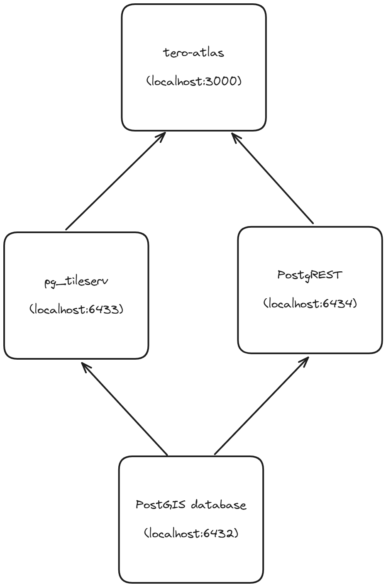

# Tero Atlas

This prototype was developed with using a Typescript + React + Tauri stack. It features an off the shelf backend with a PostGIS database, a PostgREST API for handling data requests and a pg_tileserv for handling vector tiles.

The overall structure of the app follows this pattern, using the ports as configured on the `docker-compose.yml` file:



You can either run the frontend as a web app through `localhost:3000` or install the Tauri desktop app and run it from there. The artifacts are built by the Github Actions CI pipeline and can be downloaded from the [Releases](https://github.com/paschendale/tero-atlas/releases) page. Either way, you will need to run the backend first, which can be done by running `docker-compose up` in the root directory or by following the instructions below.

## Running the app

### Installing Docker

To run the app you will need to have Docker and Docker Compose installed. The easiest way to do it is by installing Docker Desktop for Windows or Mac, or by installing Docker on Linux.

- Install Docker Desktop for Windows or Mac following the instructions on the [Docker website](https://www.docker.com/products/docker-desktop/).
- Install Docker on Linux following the instructions on the [Docker website](https://docs.docker.com/engine/install/ubuntu/).

### Downloading the database image

Tero Atlas uses a PostGIS database with pre-built queries to showcase the use of the system. The database can be downloaded on this link: [Tero Atlas Database](https://1drv.ms/u/s!AuKYaGBxmghfqppxI3a_HzR09U0gzw?e=kiy0SC).

After downloaded, you will need to store the `.sql` file in the `initdb` folder of the Tero Atlas repository. You can do this by dragging the file into the folder or by running the following command in the root directory:

```bash
cp <path-to-backup-file> ./initdb/teroatlas.sql
```

### Running the app

To run the app, you will need to run the following commands in the root directory:

```bash
docker-compose up
```

This will start the database, the vector tile server, the PostgREST API and the frontend.

It will take a few minutes for the database to be ready, so you might need to wait a bit before opening the frontend.